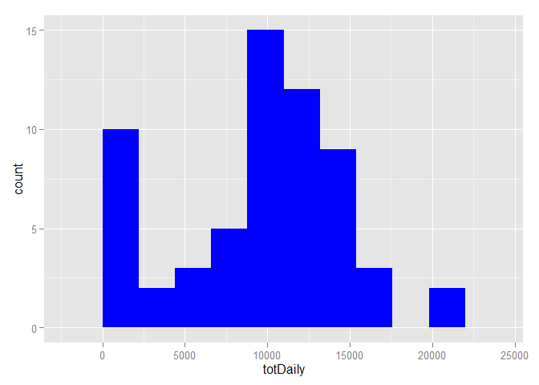
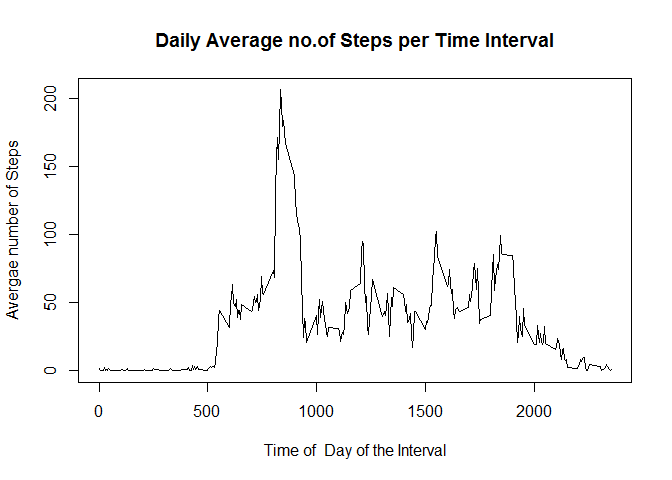
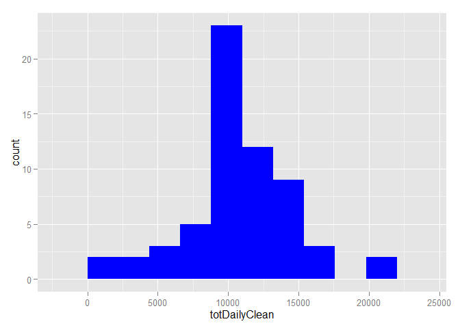

# Reproducible Research: Peer Assessment 1


```r
rm(list=ls())
options(stringsAsFactors = FALSE)

if (!is.element("ggplot2",installed.packages()) ) {install.packages("ggplot2")}
library(ggplot2)
```


## Loading and preprocessing the data


```r
if (!file.exists("activity.csv")) {unzip("activity.zip")}

Activity<-read.csv("activity.csv")
```


## What is mean total number of steps taken per day?

```r
totDaily<-tapply(Activity$steps,Activity$date,sum,na.rm=TRUE)
q <- qplot(totDaily, geom="histogram", binwidth = 2200, fill=I("blue"))

print(q)
```

 

```r
# Calculate the meanand Median

MeanDailySteps<-mean(totDaily)
MedianDailySteps<-median(totDaily)
```
The mean of the number of steps taken per day (ignoring NA) is 9354.2295082  
The median of the number of steps taken per day (ignoring NA) is 10395  

## What is the average daily activity pattern?

```r
##    plot (i.e. type = "l") of the 5-minute interval (x-axis) 
##    and the average number of steps taken, averaged across all days (y-axis)
##    compute the plot
##

AvgByInterval<-tapply(Activity$steps,as.factor(Activity$interval),mean, na.rm=TRUE)

forPlot <- data.frame(Time=levels(factor(Activity$interval)),AvgSteps=as.numeric(AvgByInterval))

plot (forPlot$Time,forPlot$AvgSteps,type="l",main="Daily Average no.of Steps per Time Interval",
      ylab="Avergae number of Steps",xlab="Time of  Day of the Interval")
```

 

```r
TimeOfMaxAverage <- forPlot[which.max( forPlot[,2]),1]
```

The time of day of the interval with maximum avergae steps is 835  

## Imputing missing values


```r
NumofNA <- sum(!complete.cases(Activity))
```
total number of missing cases is 2304  


```r
Clean <- Activity

for (i in 1:length(Activity[,1])) {
  if (is.na(Clean[i, "steps"])) {
    Clean[i, "steps"] <- forPlot[match(as.character(Clean[i,"interval"]), forPlot[,"Time"]), "AvgSteps"]
  }
}
  
totDailyClean<-tapply(Clean$steps,Clean$date,sum,na.rm=TRUE)

# Plot a histogram
q <- qplot(totDailyClean, geom="histogram", binwidth = 2200, fill=I("blue"))

print(q)
```

 

```r
# Calculate the mean and Median

MeanDailyStepsClean<-mean(totDailyClean)
MedianDailyStepsClean<-median(totDailyClean)
```

The mean of the clean data is 1.0766189\times 10^{4}  
The median of the clean data is 1.0766189\times 10^{4}  


## Are there differences in activity patterns between weekdays and weekends?

Create a new factor variable in the dataset with two levels - "weekday" and "weekend" indicating whether a given date is a weekday or weekend day.


```r
Clean$day <- "weekday"
for (i in 1:length(Clean[,1])) {
  if (as.POSIXlt(Clean[i,"date"])$wday==6 | as.POSIXlt(Clean[i,"date"])$wday==0) {
    Clean[i, "day"] <- "weekend"
  }
} 
  
Clean$day <- as.factor(Clean$day)
```

